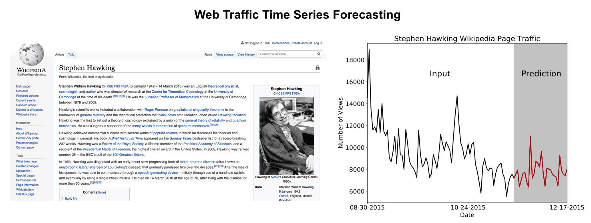
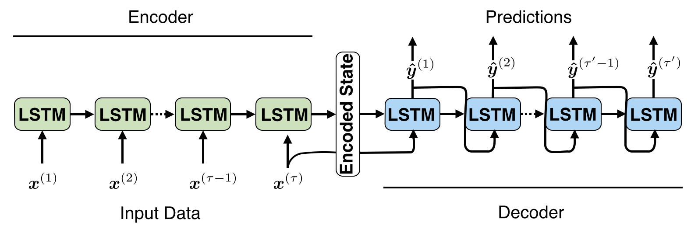
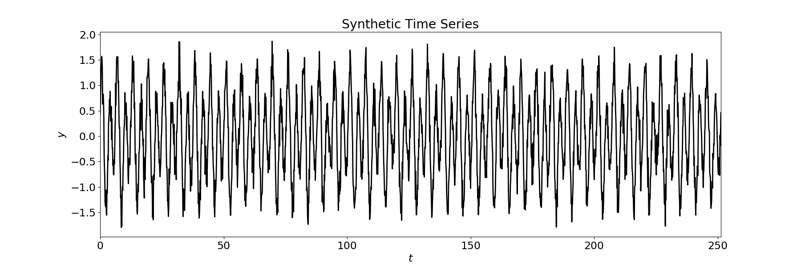
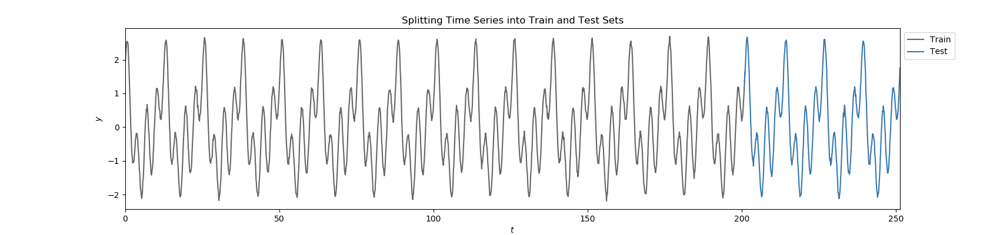
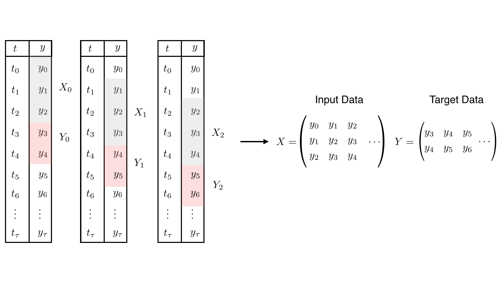
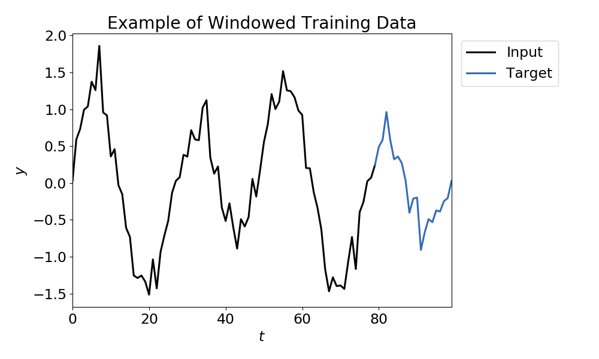
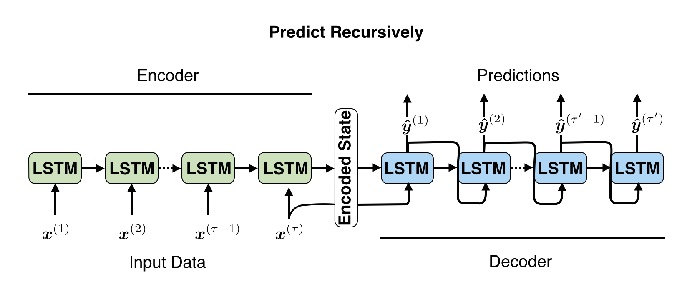
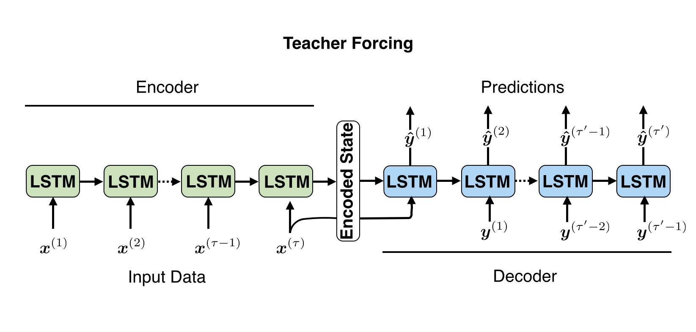
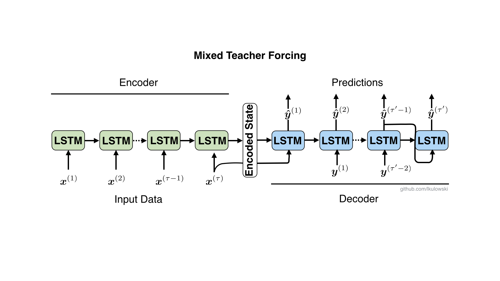
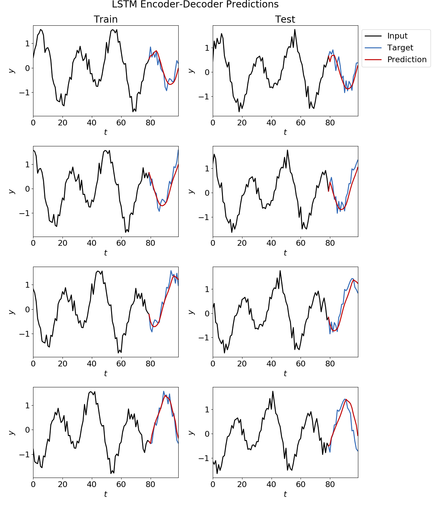

# Building a LSTM Encoder-Decoder using PyTorch to make Sequence-to-Sequence Predictions

## Requirements 
- `Python 3+` 
- `PyTorch`
- `numpy`

## 1 Overview 
There are many instances where we would like to predict how a time series will behave in the future. For example, we may be interested in forecasting web page viewership, weather conditions (temperature, humidity, etc.), power usage, or traffic volume. In this project, we will focus on making sequence-to-sequence predictions for time series data. A sequence-to-sequence prediction uses _n<sub>i</sub>_ input values of the time series to predict the next _n<sub>o</sub>_ values. An example sequence-to-sequence prediction for the number of views Stephen Hawking's Wikipedia page receives is shown below.   
<p align="center">
  
    <br>  
</p>

Here, the past few months of viewership (black) would be used to predict the next month (red) of viewership.  

For sequence-to-sequence time series predictions, the past values of the time series often influence the future values. In the case of Stephen Hawking's Wikipedia page, more people might view his page after a film or documentary about him is released. The increase in public discussion might stimulate other people to view his Wikipedia page, causing an upward trend in viewership. The Long Short-Term Memory (LSTM) neural network is well-suited to model this type of problem because it can learn long-term dependencies in the data. To make sequence-to-sequence predictions using a LSTM, we use an encoder-decoder architecture. 

<p align="center">
   
</p>

The LSTM encoder-decoder consists of two LSTMs. The first LSTM, or the encoder, processes an input sequence and generates an encoded state. The encoded state summarizes the information in the input sequence. The second LSTM, or the decoder, uses the encoded state to produce an output sequence. Note that the input and output sequences can have different lengths.  

We will build a LSTM encoder-decoder using PyTorch to make sequence-to-sequence predictions for time series data. For illustrative purposes, we will apply our model to a synthetic time series dataset. In [Section 2](#2-preparing-the-time-series-dataset), we will prepare the synthetic time series dataset to input into our LSTM encoder-decoder. In [Section 3](#3-build-the-lstm-encoder-decoder-using-pytorch), we will build the LSTM encoder-decoder using PyTorch. We discuss how we train the model and use it to make predictions. Finally, in [Section 4](#4-evaluate-lstm-encoder-decoder-on-train-and-test-datasets), we will evaluate our model on the training and test datasets.

## 2 Preparing the Time Series Dataset

We prepare the time series dataset in `generate_dataset.py`. For our time series, we consider the noisy sinusoidal curve plotted below. 

<p align="center">
  
  </p>

We treat the first 80 percent of the time series as the training set and the last 20 percent as the test set. The time series, split into the training and test data, is shown below. 

<p align="center">
  
  </p>

Right now, our dataset is one long time series. In order to train the LSTM encoder-decoder, we need to subdivide the time series into many shorter sequences of _n<sub>i</sub>_ input values and _n<sub>o</sub>_ target values. We can achieve this by _windowing_ the time series. To do this, we start at the first _y_ value and collect _n<sub>i</sub>_ values as input and the next _n<sub>o</sub>_ values as targets. Then, we slide our window to the second (stride = 1) or third (stride = 2) _y_ value and repeat the procedure. We do this until the window no longer fits into the dataset, for a total of _n<sub>w</sub>_ times. We organize the inputs in a matrix, _X_, with shape (_n<sub>i</sub>_, _n<sub>w</sub>_) and the targets in a matrix, _Y_, with shape (_n<sub>o</sub>_, _n<sub>w</sub>_). The windowing procedure is shown schematically for _n<sub>i</sub>_ = 3, _n<sub>o</sub>_ = 2, and stride = 1 below. 

<p align="center">
  
  </p>

We will feed _X_ and _Y_ into our LSTM encoder-decoder for training. The LSTM encoder-decoder expects _X_ and _Y_ to be 3-dimensional, with the third dimension being the number of features. Since we only have one feature, _y_, we augment the shape of _X_ to (_n<sub>i</sub>_, _n<sub>w</sub>_, 1) and _Y_ to (_n<sub>o</sub>_, _n<sub>w</sub>_, 1). 

We apply the windowing procedure to our synthetic time series, using _n<sub>i</sub>_ = 80, _n<sub>o</sub>_ = 20, and stride = 5. A sample training window is shown below.  

<p align="center">
  
  </p>
  
## 3 Build the LSTM Encoder-Decoder using PyTorch

We use PyTorch to build the LSTM encoder-decoder in `lstm_encoder_decoder.py`. The LSTM encoder takes an input sequence and produces an encoded state (i.e., cell state and hidden state). We feed the last encoded state produced by the LSTM encoder as well as the last value of the input data, , into the LSTM decoder. With this information, the LSTM decoder makes predictions. During training, we allow the LSTM decoder to make predictions in three different ways. First, we can predict recursively. 

<p align="center">
  
  </p>

That is, we recurrently feed the predicted decoder outputs, , into the LSTM decoder until we have an output of the desired length. Second, we can make predictions using teacher forcing. In teacher forcing, we feed the true target value, , into the LSTM decoder. 

<p align="center">
  
  </p>

Teacher forcing acts like "training wheels." If the model makes a bad prediction, it is put back in place with the true value. Finally, we can make predictions using mixed teacher forcing.

<p align="center">
  
  </p>

Sometimes, we provide the LSTM decoder with the true value, while other times we require it to use the predicted value. Thus, the "training wheels" are on some of the time. When we use teacher forcing or mixed teacher forcing, we provide an option in the code called dynamic teacher forcing. If dynamic teacher forcing is turned on, the amount of teacher forcing is slowly reduced each epoch. Dynamic teacher forcing helps the model learn the structure of the data at the beginning of training, but then slowly transitions it to make predictions on its own. 

Once the LSTM decoder has produced an output sequence of the desired length, we compare the predicted values to the true target values and compute the mean squared error as our loss function. We then use backpropagation to adjust the weights in the LSTM gates to minimize the loss function.    

After we have trained the LSTM encoder-decoder, we can use it to make predictions for data in the test set. All predictions for test data are done recursively. 

## 4 Evaluate LSTM Encoder-Decoder on Train and Test Datasets

Now, let's evaluate our model performance. We build a LSTM encoder-decoder that takes in 80 time series values and predicts the next 20 values in `example.py`. During training, we use mixed teacher forcing. We set the level of mixed teacher forcing so that there is a 60 percent chance between predicting recursively and using teacher forcing. For this run, we set the size of the encoded state produced by the LSTM encoder to 15. Longer hidden states allow the LSTM encoder to store more information about the input series. The model specifications are shown below. 

```
model = lstm_encoder_decoder.lstm_seq2seq(input_size = X_train.shape[2], hidden_size = 15)

loss = model.train_model(X_train, Y_train, n_epochs = 50, target_len = ow, batch_size = 5, 
                         training_prediction = 'mixed_teacher_forcing', teacher_forcing_ratio = 0.6, 
                         learning_rate = 0.01, dynamic_tf = False)
```

We have plotted a few examples of our model for the train and test data.  

<p align="center">
  
  </p>

We see that for both the train and test sets, the LSTM encoder-decoder is able to learn the pattern in the time series.  
