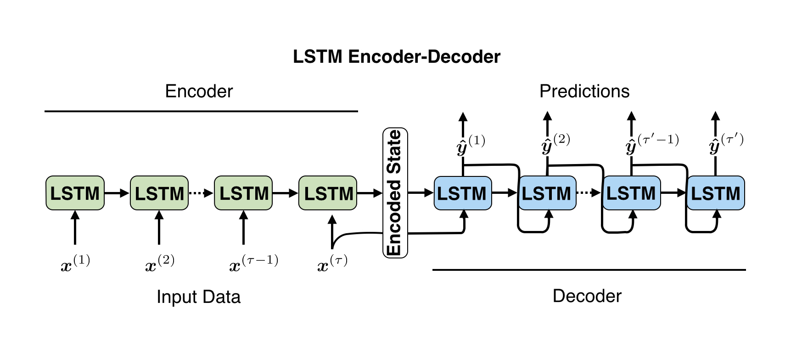

# Building a LSTM Encoder-Deconder using PyTorch to make Sequence-to-Sequence Predictions

## Requirements 
- Python 3 
- PyTorch

## 1 Overview 
There are many instances where we would like to predict how a time series will behave in the future. For example, we may be interested in forcasting web page viewership, weather conditions (temperature, humidity, etc.), power usage, or traffic volume. A sequence-to-sequence prediction for time series data involves using $m$ input values to predict the next $n$ values. An example sequence-to-sequence prediction for the number of views Stephen Hawking's Wikipedia page receives is shown below. Here, the past few months of viewership (black) is used to predict the next month of viewership (red).  

  
     
 <em>  An example time series sequence-to-sequence prediction for the number of views Stephen Hawking's Wikipedia page receives is: given the past few months of viewership, how many times will the page be viewed in the next month?  </em>  

For sequence-to-sequence time series predictions, the past values of the time series often influence future values. In the case of Stephen Hawking's Wikipedia page, XXX. The Long Short-Term Memory (LSTM) neural network is well-suited for this type of problem because it can learn long-term dependencies in the data. To make sequence-to-sequence predictions using a LSTM, we use an encoder-decoder architecture, which is shown below. 

  
     
 <em>  The LSTM encoder-decoder allows us to make sequence-to-sequence predictions. The LSTM encoder summarizes the information from an the input sequence in an encoded state. The LSTM decoder takes the encoded state and uses it to produce an output sequence.   </em>  

The LSTM encoder-decoder consists of two LSTMs. The first LSTM, or the encoder, processes an input sequence and generates an encoded state. The encoded state summarizes the informaiton in the input sequence. The second LSTM, or the decoder, uses the encoded state to produce an output sequence. Note that the input and output sequences can have different lengths.  

In this project, we will build a LSTM encoder-decoder to make sequence-to-sequence predictions for time series data. For illustrative purposes, we will apply our model to a synthetic time series dataset. In [Section 2](#2-preparing-the-time-series-dataset), we will prepare the synthetic time series dataset to input into our LSTM encoder decoder. In [Section 3](#3-build-the-lstm-encoder-decoder-using-pytorch), we will build the LSTM encoder-decoder using PyTorch. In [Section 4](#4-train-the-model-and-make-predictions), we will train the model and use it to make predictions. Finally, in [Section 5](#5-evaluate-lstm-encoder-decoder-on-train-and-test-datasets), we will evaluate our model on the train and test datasets.

## 2 Preparing the Time Series Dataset

For our time series, we consider the noisy sinusoidal curve plotted below. 

  
  

We treat the first 80 percent of the time series as the training set and the last 20 percent as the test set. The time series, split into the train and test data, is shown below. 

  
  

## 3 Build the LSTM Encoder-Decoder using PyTorch

## 4 Train the Model and Make Predictions

## 5 Evaluate LSTM Encoder-Decoder on Train and Test Datasets

